# Functionalities of the Railway Reservation System

The below services are always available to the **dbAdmin** role and to the **SuperUser**

## Services for the `station_master` Role

### Add a New Railway Station

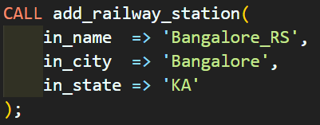

### Add a New Train and its Schedule

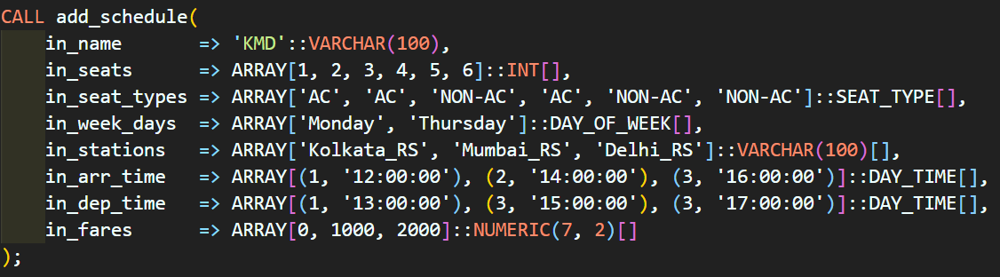

### Update the Delay Time of a Train

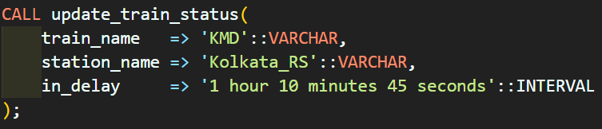

### Other Services

`ALL` permissions on the tables **railway_station**, **train**, **schedule**, **seat**

## Services for the `users` Role (Customers with an account)

### Book Tickets

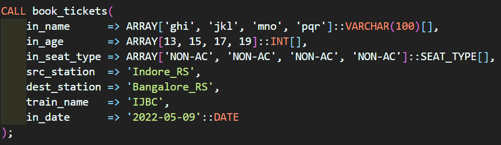

The trigger will try to auto-allocate the best possible seat for the passengers if available.

### Cancel Booking

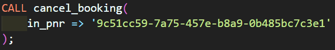

The trigger will try to auto-allocate the best possible seat for the passengers having ticket status as **Waiting** for the same date and train.

### Other Services

-   `ALL` permissions on the tables **users** and **passenger** with **`Row Level Security`** implemented

    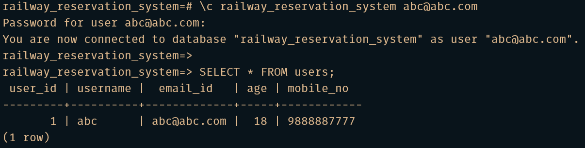

    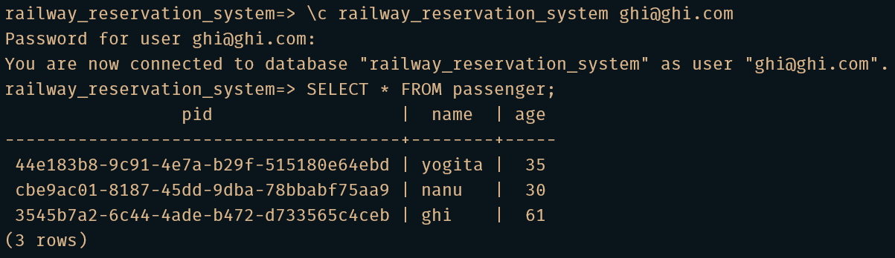

-   `SELECT` permissions on the **ticket** table with **`Row Level Security`** implemented

## Services for everyone

### Create a New Account and Register as a Customer

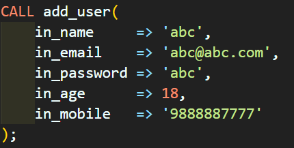

### Available Trains Between Two Given Stations On a Given Date

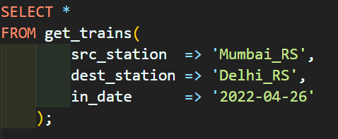

### Full Schedule of a Given Train

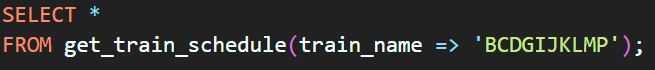

### Schedule of Different Trains at a Given Station

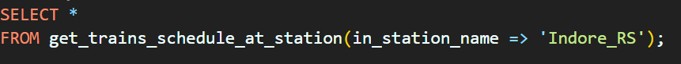

### Fare of a Given Train Between Two Given Stations

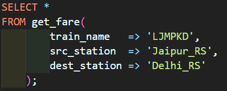

### Get Details of a Passenger Given PNR

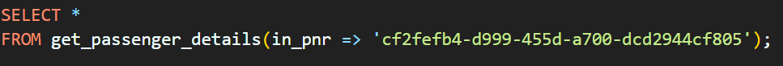

### Number of Seats Available in a Given Train Between Two Given Stations on a Given Date

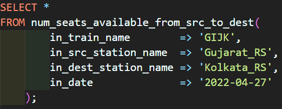

### Check Ticket Status

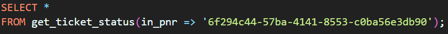

### Check Delay Time of a Train

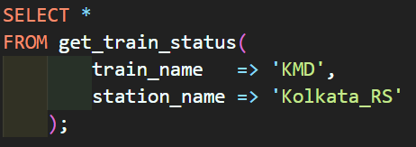
