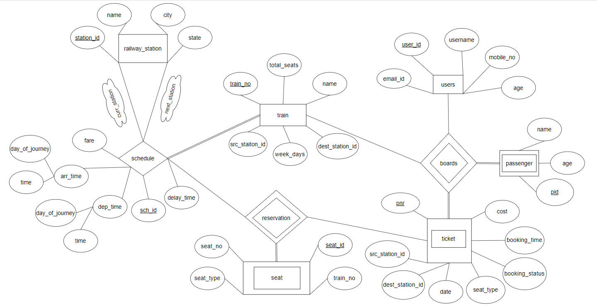
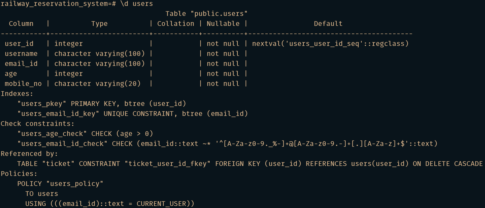
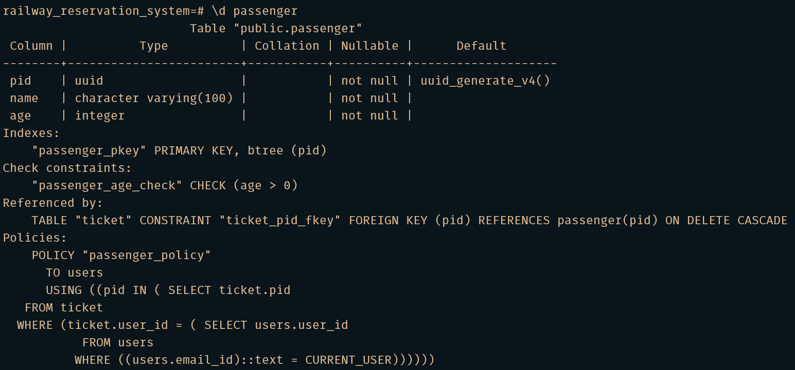
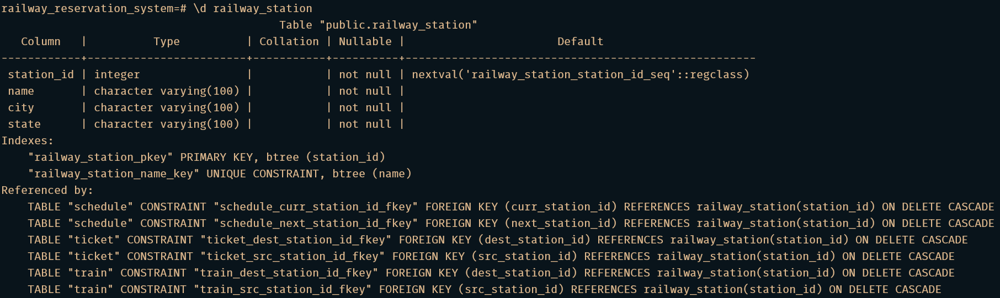
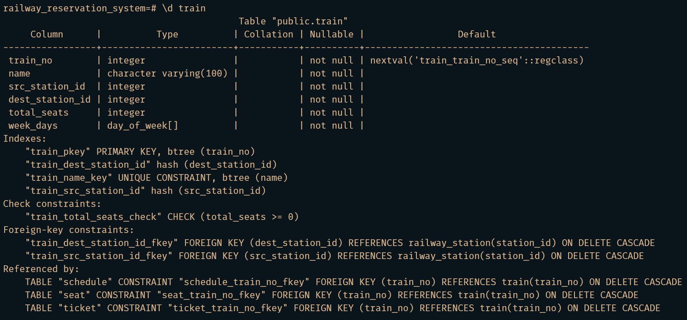
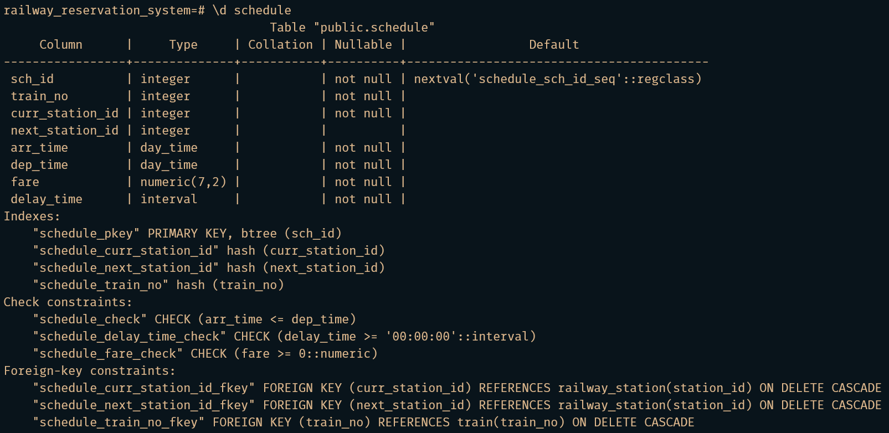
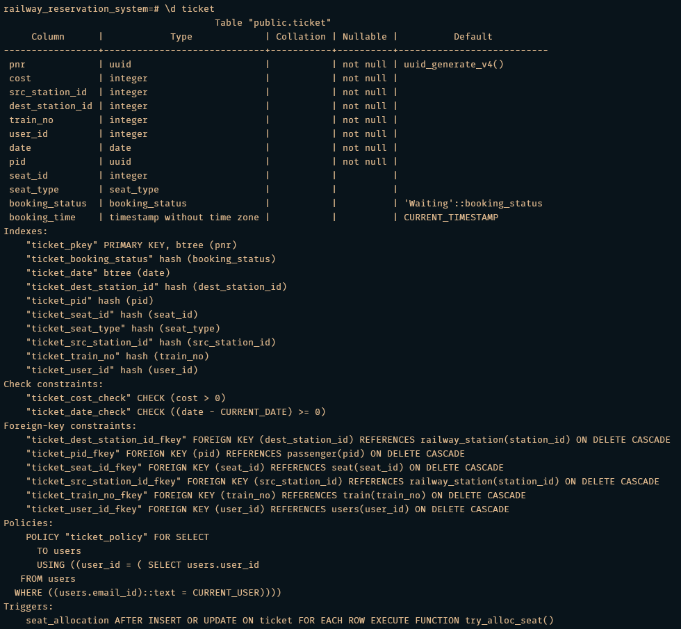

# Railway Reservation System

This project aims to build a railway reservation system which is a software application that handles the entire booking data of the railway. It has been developed to override the problems prevailing in the practical manual system. It is fully based on the concept of reserving train tickets for various destinations reliably and consistently. It reduces the stress and workload of the employee who books the ticket. It also lets the travelers book and finds schedules for the trains with ease. This software can also be used by different railway companies to carry out operations in a smooth, effective, and automated manner.

## Technologies Used

-   PostgreSQL
-   PLpgSQL

## Installation

-   Install [postgres](https://www.postgresql.org/download/)
-   Clone this repository
    ```sh
    $ git clone git@github.com:Smile040501/RailwayReservationSystem.git
    ```
-   Change the directory to the source code directory
    ```sh
    $ cd RailwayReservationSystem/src
    ```
-   Start **psql** and execute the **makefile.sql**.\
    The passwords for the testing users are their names itself which needs to be entered for every execution of the makefile.
    ```sh
    $ psql -U postgres
    ```
    ```
    postgres=# \i makefile.sql
    ```

## ER Diagram



## Structure, Integrity and General Constraints of the Database

**Users** (Customers with an account and the authority to book tickets)



**Passengers** (Miscellaneous customers)



**Railway Stations**



**Trains**



**Schedule**



**Ticket**



## Functionalities of the Project

See [`FUNCTIONALITIES.md`](FUNCTIONALITIES.md) for detailed usage.

-   Services for the `station_master` Role
    -   Add a New Railway Station
    -   Add a New Train and its Schedule
    -   Update the Delay Time of a Train
-   Services for the `users` Role (Customers with an account)
    -   Book Tickets
    -   Cancel Booking
-   Services for everyone
    -   Create a New Account and Register as a Customer
    -   Available Trains Between Two Given Stations On a Given Date
    -   Full Schedule of a Given Train
    -   Schedule of Different Trains at a Given Station
    -   Fare of a Given Train Between Two Given Stations
    -   Get Details of a Passenger Given PNR
    -   Number of Seats Available in a Given Train Between Two Given Stations on a Given Date
    -   Check Ticket Status
    -   Check Delay Time of a Train

## Design

See [`DESIGN.md`](DESIGN.md)

## Contributors

<table>
    <tr>
        <td align="center">
            <a href="https://www.linkedin.com/in/mayank-singla-001pt">
                
                <br/>
                <sub>
                    <b>Mayank Singla</b>
                </sub>
            </a>
        </td>
        <td align="center">
            <a href="https://github.com/mishra-satyam">
                
                <br/>
                <sub>
                    <b>Satyam Mishra</b>
                </sub>
            </a>
        </td>
        <td align="center">
            <a href="https://github.com/agarwaladitya0401">
                
                <br/>
                <sub>
                    <b>Aditya Agarwal</b>
                </sub>
            </a>
        </td>
    </tr>
</table>

## License

[MIT](LICENSE)
